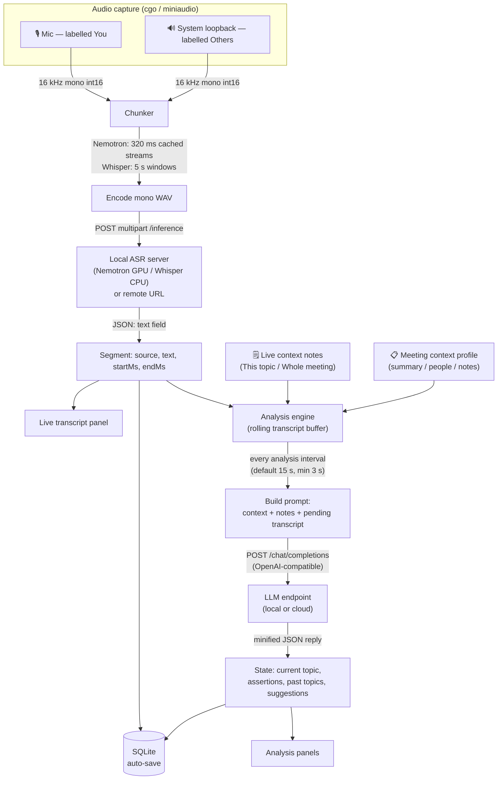

# Parley — local-first meeting assistant

Parley listens to a live conversation by capturing your microphone and the
computer's output as separate, labelled sources. It transcribes them locally and
uses an LLM to surface — in real time — the **current topic**, **assertions** made
(attributed to *You* vs *Others*), a history of **past topics**, and **suggested
questions**.

It is **local-first**: the bundled transcription engines keep audio and
transcription on your machine. Network traffic during a meeting goes only to the
LLM endpoint you configure and, if you explicitly configure one, a remote
transcription server. Both endpoints can be local. Installing the optional NVIDIA
engine downloads its private runtime and model once from upstream repositories.

- **Stack:** Wails 3 (alpha) · Go backend · React + TypeScript + Tailwind/shadcn UI
- **Transcription:** Nemotron 3.5 ASR Streaming on NVIDIA; bundled CPU `whisper.cpp` fallback
- **LLM:** any OpenAI-compatible endpoint (local llama-server / LM Studio / Ollama, or cloud)

---

## What works today

- 🎙️ **Dual capture** — your mic (*You*) + system/loopback audio (*Others*), kept
  as separately labelled sources.
- 📝 **Live transcript** with speaker labels, recorded to disk per source.
- 🧠 **Live analysis** — current topic, assertions, past topics, suggested questions.
- 🗒️ **Reusable context profiles** — agenda, attendees, notes to ground the analysis.
- 💬 **Live context injection** — correct or add context mid-meeting (see below).
- 💾 **Save / load / resume meetings** — every meeting is auto-saved; reopen it to
  review, or **resume** it to keep recording (multi-part meetings).
- 🔌 **Bring-your-own transcription** — offload STT to a compatible remote server.
- 🧰 **Saved LLM connections** — store multiple providers (local + cloud) and switch
  between them per meeting from the header, without re-entering URLs/keys each time.
- 🔎 **Visible runtime details** — the footer shows the packaged Parley version and
  the voice-to-text backend actually selected (Nemotron GPU, Whisper CPU, or remote).

---

## How it works

Parley is a pipeline: audio is captured per source, sliced into fixed windows,
transcribed locally, and the rolling transcript is periodically summarised by an
LLM into the topic/assertions/suggestions you see on screen.



With a bundled transcription engine, audio and transcription stay local. An LLM
call leaves the machine only when its configured endpoint is remote; audio also
leaves the machine when you explicitly configure a remote transcription URL.
Installing Nemotron downloads its runtime/model once before a meeting, not while
capturing audio.

### The analysis interval

A ticker fires every **`analysisIntervalSec`** seconds (Settings → *Analysis
interval*, default **15 s**, floor **3 s**). On each tick the engine
([`internal/analysis/engine.go`](internal/analysis/engine.go)):

1. **Skips** the tick if the previous analysis is still in flight, or if no new
   transcript lines have arrived since the last run (no churn on a quiet meeting).
2. Builds a prompt from transcript lines that arrived since the last successful
   analysis, plus the prior meeting state, meeting context, and in-effect live
   notes. The retained rolling transcript is capped at 600 lines.
3. Sends one **non-streaming** chat completion (`temperature: 0.2`) and parses the
   reply. The whole transcript buffer is capped at 600 lines, and at most 30 past
   topics are retained.

A shorter interval = fresher insight but more LLM calls; a longer interval is
cheaper and calmer. Transcription is independent of this: Nemotron advances
cache-aware streams every 320 ms and publishes coalesced transcript segments at
about one-second cadence; the CPU Whisper fallback uses independent 5-second windows.

### How topics are decided

The LLM is asked to return a `topicChanged` boolean alongside the current topic
title. The engine only **rolls over** a topic when *all* of these hold: the model
says `topicChanged: true`, there is an existing current topic, and the new title
actually differs (case-insensitive) from the previous one. On rollover the previous
topic is archived into **Past topics**, and any **topic-scoped** live notes are
dropped so a stale correction can't bleed into the next topic.

### HTTP payloads

**Transcription** — `POST {sttURL}/inference`, `multipart/form-data`:

| field | value |
|-------|-------|
| `file` | `chunk.wav` (mono, 16 kHz, signed-16 PCM WAV) |
| `response_format` | `json` |
| `temperature` | `0.0` |

Response: `{ "text": "the transcribed text" }`

The local Nemotron sidecar additionally accepts `POST /stream` with `stream_id`,
`action=feed|finish`, and a WAV `file` for feed actions. Parley keeps one stream
per capture source, preserving the model's encoder/decoder cache between frames.

**Analysis** — `POST {llmBaseURL}/chat/completions` (OpenAI-compatible),
`Authorization: Bearer <key>` if a key is set:

```jsonc
{
  "model": "local-model",
  "messages": [
    { "role": "system", "content": "You monitor a live meeting transcript… return ONLY a JSON object {currentTopicTitle, currentTopicSummary, topicChanged, assertions[], suggestions[]}" },
    { "role": "user",   "content": "MEETING CONTEXT … RECENT TRANSCRIPT …" }
  ],
  "temperature": 0.2,
  "stream": false
}
```

The reply's `choices[0].message.content` is a minified JSON object that becomes the
analysis State:

```json
{"currentTopicTitle":"Q3 pricing","currentTopicSummary":"Debating list price vs. discount floor.","topicChanged":true,"assertions":[{"speaker":"Others","text":"Margin can't drop below 40%."}],"suggestions":[{"kind":"question","text":"What's the volume threshold for the discount?"}]}
```

### How your context reaches the LLM

Two kinds of user-supplied context are folded into the **user** message every
analysis tick (see `buildUserPrompt`):

- **Meeting context profile** (notebook icon) — a reusable agenda/attendees/notes
  block, emitted as a `MEETING CONTEXT` header.
- **Live notes** typed during the meeting, by scope:
  - **Whole meeting** → listed under **STANDING CORRECTIONS** (names, acronyms,
    themes); they ride along on *every* subsequent tick for the whole session.
  - **This topic** → listed under **NOTE ON CURRENT TOPIC** and trusted over the
    transcript; they expire automatically when the topic rolls over.

The assembled user prompt looks like:

```text
MEETING CONTEXT
Summary: Weekly account sync with Acme
People: Dana (us), Priya (Acme)
Notes: Renewal due end of quarter

STANDING CORRECTIONS (apply to the whole meeting — e.g. correct names, acronyms, themes):
- The client is Acme — A-C-M-E

NOTE ON CURRENT TOPIC (corrects the immediate discussion only — trust over the transcript if they conflict):
- This is about gross margin, not revenue

PREVIOUS TOPIC TITLE: Renewal timeline

RECENT TRANSCRIPT. Speaker labels: "You" = the listener; "Others" = remote participants; "Room" = mixed in-person capture:
You: so on margin, where do we land?
Others: we can't go below forty percent…

Return the JSON object now.
```

> 🔧 **Keep this section current:** if you change the chunk window, the analysis
> cadence, the prompt shape, or either HTTP contract, update the diagram and the
> payloads above so the README stays the source of truth for how Parley works.

---

## Install on Windows

Download the latest `Parley-Setup-vX.Y.Z.exe` from
[GitHub Releases](https://github.com/ridaken/Parley/releases/latest) and run it.
The per-user installer does not require administrator access and includes the CPU
Whisper engine/model, so local transcription needs no additional download or setup.

On a fresh install, an eligible NVIDIA GPU triggers automatic Nemotron
provisioning. On an interactive upgrade, the installer preserves an existing
complete Nemotron installation; if Nemotron is missing and an NVIDIA GPU is
detected, it asks before downloading several gigabytes. Declining or encountering
a provisioning problem leaves the bundled CPU fallback available. Silent upgrades
never begin the optional download.

After launch, the footer shows the installed Parley version and the selected
voice-to-text backend. The displayed app version is injected from the same version
used for the GitHub release and installer.

---

## Prerequisites

These prerequisites are for building Parley from source; users installing the
Windows release do not need them.

| Tool | Notes |
|------|-------|
| [Go](https://go.dev/dl/) 1.25+ | Backend. |
| Node.js 20.19+ (or 22.12+) / npm | Frontend; required by Vite 8. |
| [Wails 3 CLI](https://v3.wails.io/) | `go install github.com/wailsapp/wails/v3/cmd/wails3@latest` |
| [Task](https://taskfile.dev/) | **Optional** shortcut runner for `Taskfile.yml`. See the note below. |
| **A C compiler (cgo)** | Required by the audio library (`malgo`). See per-OS notes. |

> **Seeing `'task' is not recognized`?** `task` is the optional [Task](https://taskfile.dev/)
> runner — a separate tool, **not** a Windows built-in — so that error just means you
> haven't installed it. You don't need it. Anywhere this README says `task <name>`, you can:
> - run the plain command shown next to it, **or**
> - run `wails3 task <name>` instead (the Wails CLI you already have includes a Task runner), **or**
> - install Task once: `winget install Task.Task` (or `go install github.com/go-task/task/v3/cmd/task@latest`).

### C toolchain (cgo) — required

Audio capture uses miniaudio via cgo, so a C compiler must be on `PATH`:

- **Windows:** install [Zig](https://ziglang.org/download/) and set `CC="zig cc"`,
  **or** install mingw-w64 (e.g. via [MSYS2](https://www.msys2.org/) or
  [w64devkit](https://github.com/skeeto/w64devkit)). Verify with `gcc --version`.
- **macOS:** `xcode-select --install` (Clang).
- **Linux:** `gcc` + ALSA/PipeWire dev headers (e.g. `sudo apt install build-essential libasound2-dev`).

---

## Local transcription engines

On Windows, a packaged install checks for an NVIDIA GPU. If one is available with
at least 6 GiB VRAM and compute capability 7.0, a fresh install provisions
[`nvidia/nemotron-3.5-asr-streaming-0.6b`](https://huggingface.co/nvidia/nemotron-3.5-asr-streaming-0.6b)
plus its private Python/CUDA runtime under `resources/nemotron/`. Only the 2.55 GB
Transformers checkpoint is fetched; the duplicate 2.37 GB NeMo archive is excluded.
The resulting installation is reused in place on app upgrades, so a complete model
is not redownloaded. An interactive upgrade prompts before provisioning when the
`.ready` marker is missing; a silent upgrade keeps CPU Whisper instead.

Nemotron is Parley's preferred NVIDIA backend. It is a 600M-parameter,
cache-aware FastConformer-RNNT model with punctuation and capitalization. If GPU
provisioning or model startup fails for any reason, Parley automatically uses the
small CPU Whisper engine that is included in every installer. Provisioning failure
does not fail the Parley install. Parley begins loading the selected local engine in
the background as soon as the app opens and keeps it warm between meetings. The
footer reports loading progress and the backend that was actually selected, including
a CPU fallback after a failed Nemotron startup.

### Developer setup

The whisper binaries and model are **large and not committed** (see `.gitignore`),
and development checkouts do **not** auto-download them. Fetch the CPU fallback:

```powershell
# Run from the repo root in PowerShell. This is all `task setup:whisper` does:
pwsh -NoProfile -ExecutionPolicy Bypass -File ./scripts/setup-whisper.ps1

# Equivalent shortcuts (only if you have the runners): task setup:whisper  /  wails3 task setup:whisper

# Options (smaller/faster model, or a developer-only engine build):
pwsh ./scripts/setup-whisper.ps1 -Model ggml-base.en.bin -Variant blas
```

This places everything where Parley looks:

```
resources/whisper/bin/Release/whisper-server.exe     # CPU fallback + DLLs
resources/whisper/models/ggml-small.en-q5_1.bin       # default CPU model
```

To exercise the packaged NVIDIA path from a checkout, run the same idempotent
provisioner the installer uses (expect several GB of downloads):

```powershell
pwsh -NoProfile -ExecutionPolicy Bypass -File ./resources/nemotron/setup.ps1
# Equivalent: task setup:nemotron / wails3 task setup:nemotron
```

That script downloads a private Python 3.11 runtime with `uv`, CUDA PyTorch,
Transformers 5.13+, and the model checkpoint. It writes
`resources/nemotron/.ready` only after CUDA and the local model configuration
validate successfully.

Parley uses Nemotron's default 320 ms native streaming mode and keeps independent
cache state for the microphone and system-audio sources. Transformers' RNNT
generation mutates temporary decoder state, so the sidecar loads two FP16 model
instances rather than unsafely sharing one instance across simultaneous streams.
Token deltas are coalesced into transcript rows at roughly one-second cadence.

If a corporate proxy blocks the download (Hugging Face / GitHub), the script prints
the exact URL and target path so you can drop the files in manually — or skip the
bundled engine and set a **remote transcription URL** in Settings (see below).

> **Sources:** binaries come from
> [ggml-org/whisper.cpp releases](https://github.com/ggml-org/whisper.cpp/releases);
> models from [Hugging Face: `ggerganov/whisper.cpp`](https://huggingface.co/ggerganov/whisper.cpp/tree/main).
> (The GitHub org is `ggml-org`, but the model files live under the original
> author's Hugging Face namespace `ggerganov` — pointing at `ggml-org` on Hugging
> Face returns a misleading **401**, since HF answers 401 for repos that don't exist.)

### Choosing a Whisper fallback model

The default — **`ggml-small.en-q5_1.bin`** (~182 MB) — is chosen for a capable
enterprise laptop that needs to stay responsive for other work: it is quantized
(low RAM/CPU), transcribes a 5-second chunk in well under a second, and is markedly
better than `base` at names, acronyms, and jargon — exactly what meetings are full
of. Whisper only works in short bursts per audio chunk, so even this leaves plenty
of headroom. Tune in **Settings → Transcription**:

This setting controls only the CPU fallback; a ready Nemotron installation takes
precedence on NVIDIA systems.

| Model file | Size | Speed | Accuracy | When to pick it |
|------------|------|-------|----------|-----------------|
| `ggml-base.en.bin` | ~142 MB | fastest | good | older/under-powered machine |
| `ggml-small.en-q5_1.bin` *(default)* | ~182 MB | fast | better | the balanced default |
| `ggml-small.en.bin` | ~466 MB | fast | better | unquantized small |
| `ggml-large-v3-turbo-q5_0.bin` | ~547 MB | moderate | best | accuracy-first, CPU to spare |

`large-v3-turbo` is the modern speed/quality sweet spot at the top end (≈8× faster
decoding than `large-v3`); pick it if accuracy matters more than leaving the CPU idle.
Drop the file in `resources/whisper/models/` and set its filename in Settings, or pass
it to the script: `pwsh ./scripts/setup-whisper.ps1 -Model ggml-large-v3-turbo-q5_0.bin`.

### Or: use a remote transcription server

If you'd rather not transcribe on this machine, run a compatible server elsewhere
and set **Settings → Transcription → Remote transcription URL** (e.g.
`http://192.168.1.10:8765`). When set, Parley skips the bundled engine entirely.

> ⚠️ **Platform note:** the bundled-engine path is currently hard-coded to the Windows
> layout (`bin/Release/whisper-server.exe`). On macOS/Linux, use the **remote URL**
> option until the cross-platform launcher lands (see *Roadmap*).

---

## Run & build

```bash
# Development (hot reload). Uses a Vite port to avoid clashing with other dev servers.
task dev        # no Task? → wails3 dev -config ./build/config.yml -port 9245

# Production build → ./bin
wails3 build    # equivalent task form: wails3 task build (or task build)

# Package an installer
wails3 task package    # equivalent if Task is installed: task package
```

The configured build tasks set required production flags such as `-H windowsgui`
on Windows. `wails3 build` invokes that configured build path; `wails3 task build`
and `task build` are equivalent alternatives.

When packaging, make sure `resources/` ships **next to the executable** (Parley
searches the working dir and the exe's directory + parents). Release CI embeds the
CPU Whisper payload and the small Nemotron provisioner files; it does not embed the
Nemotron model or Python/CUDA runtime.

---

## Using Parley

1. **Audio sources** (sliders icon): pick your mic (label **Me**) and the system
   output to capture (label **Others**). For a single in-person mic where speakers
   can't be separated, choose **In-person / mixed** (labelled *Room*).
2. **Meeting context** (notebook icon): paste an agenda / attendees / notes, or import
   a `.txt`. Save it as a profile and mark it active to ground the analysis.
3. **Settings** (gear icon): save one **LLM connection** per provider (name, base
   URL, model, optional API key) — a local llama-server / LM Studio / Ollama, or a
   cloud URL. Mark one **active** (★), **Test** each, and set the analysis interval
   and transcription options. Switch which connection a meeting uses from the
   **LLM connection dropdown in the header** (before you start the meeting).
4. Check the footer for the installed version and selected **Voice-to-text** model.
   Local model weights begin loading when Parley opens; if the footer still says
   *Loading local model…*, starting a meeting waits only for the remaining load time.
5. **Start listening.** The transcript streams on the left; topic / assertions / past
   topics / suggestions populate on the right.

### Live context injection

While a meeting is running, use the input at the bottom of the transcript to nudge the
assistant. Pick a scope:

- **This topic** — corrects the immediate discussion (e.g. *"this is about margins, not
  revenue"*) and **expires automatically when the topic changes**, so a correction can
  never bleed stale info into the next topic.
- **Whole meeting** — standing facts that apply all session (e.g. *"the client is Acme —
  A-C-M-E"*, name spellings, themes).

Active notes appear as chips; whole-meeting notes persist, topic notes drop on a topic
change.

### Saving, loading & resuming

Every meeting is **auto-saved continuously** (transcript, topics, assertions,
suggestions, and live notes) — a crash or close never loses your data. Open **Saved
meetings** (history icon) to:

- **View** a past meeting read-only, or
- **Resume** it — Parley reloads its state and continues recording into the same
  meeting, so a conversation can span several sittings.

Audio is recorded per source under your app-data `recordings/session-<id>/` folder.

---

## Troubleshooting

- **"The local transcription engine isn't installed" on Start.** You haven't fetched
  the whisper engine yet — run **`task setup:whisper`** (or `scripts/setup-whisper.ps1`),
  or set a remote transcription URL in Settings. Parley shows the reason in a red banner
  and writes full details to **`parley.log`** in your app-data folder (Windows:
  `%AppData%\Parley\`). For a packaged build, the `resources/whisper/` folder must sit
  next to the `.exe`.
- **The installer says no NVIDIA GPU, but `nvidia-smi -L` shows one.** Install
  Parley **v0.1.3 or newer**. Older installers ran the 64-bit NVIDIA utility through
  a redirected 32-bit shell, which could incorrectly report no GPU.
- **Nemotron was not selected on an NVIDIA system.** The footer shows the backend
  Parley actually selected. Check
  `%AppData%\Parley\nemotron-server.log`. Parley requires a complete
  `resources\nemotron` installation with a `.ready` marker and falls back to CPU
  Whisper when the model cannot load. On an installed per-user copy, close Parley
  and resume provisioning from 64-bit PowerShell (the script reuses files already
  present):

  ```powershell
  powershell.exe -NoProfile -ExecutionPolicy Bypass -File "$env:LOCALAPPDATA\Programs\Parley\resources\nemotron\setup.ps1" -InstallRoot "$env:LOCALAPPDATA\Programs\Parley\resources\nemotron"
  ```
- **"No mic" with a mic selected.** The badge now reflects whether a microphone source
  actually started. If it still says *No mic*, that device failed to open (wrong device,
  in use, or unsupported format) — check `parley.log` and try another device.
- **LLM "context deadline exceeded".** The endpoint didn't answer in time — check the
  URL/port, that the server is up, and (for local servers) that the model finished
  loading. The Settings dialog now explains common failures.
- **App crashes when dragging the window between monitors.** This was a WebView2 bug:
  while the window is moving to another monitor the WebView2 controller is briefly in a
  transitional state, and `Chromium.Focus()` called `controller.MoveFocus()`
  unconditionally — which returns `ERROR_INVALID_STATE` (`0x8007139F`). Older Wails
  builds treated that transient COM error as fatal (`os.Exit(1)`), taking the whole
  process down. (It reproduces on same-DPI setups too, not only across a DPI boundary.)
  Note that Parley's panic logging could never catch this — `os.Exit(1)` bypasses
  deferred funcs and `recover()`, which is why the crash left no trace in `parley.log`.

  The crash fix is upstream issue
  [#5650](https://github.com/wailsapp/wails/issues/5650) /
  [#5568](https://github.com/wailsapp/wails/pull/5568), shipped in `webview2 v1.0.25`
  (first bundled in Wails `v3.0.0-alpha2.106`). A follow-on mixed-DPI bug where content
  shrinks then disappears after a cross-DPI drag
  ([#5677](https://github.com/wailsapp/wails/issues/5677) /
  [#5689](https://github.com/wailsapp/wails/pull/5689)) was fixed in
  `v3.0.0-alpha2.109`. This repo now targets **`v3.0.0-alpha2.109`** (pins
  `webview2 v1.0.27`), which carries both fixes. If you still see the crash:
  1. **Rebuild clean** so the fixed library is actually linked:
     `go clean -cache && rm -rf bin && wails3 build`. Confirm the resolved versions with
     `go list -m github.com/wailsapp/wails/v3` (expect `…alpha2.109`) and
     `go list -m github.com/wailsapp/wails/webview2` (expect `v1.0.27`, must be ≥ v1.0.25).
  2. **Update the WebView2 Runtime** on the machine (old Evergreen runtimes mishandle
     the DPI transition).
  3. If it persists, it's likely a different un-converted WebView2 call site — grab the
     stack from **`parley.log`** (`%AppData%\Parley\`); Parley now records panics with a
     full goroutine trace and routes crash output there, so the failing call is visible.

---

## Data & privacy

- SQLite database + log + recordings live under your OS app-config dir (`%AppData%\Parley`
  on Windows). Each LLM connection's API key is stored in the **OS keychain** (one
  entry per connection), never in the database.
- No telemetry. Transcription is local unless you opt into a remote STT URL; the LLM is
  whatever endpoint you configure. Keep both endpoints on localhost to remain fully
  offline during meetings. Installing Nemotron separately requires its one-time model
  and runtime downloads.

---

## Roadmap (high level)

See `docs/PLAN.md` for phase status and `docs/POLISH-BACKLOG.md` for deferred polish.
Next up: cross-platform bundled-engine launcher (macOS/Linux), session full-text search
and export, and richer language/model controls for transcription.
